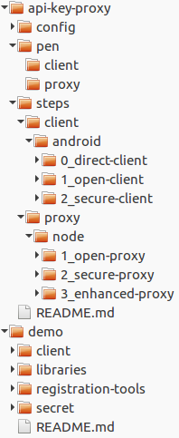

# Hands On Mobile API Security: Get Rid of Client Secrets

## Introduce an API Key Proxy to Improve Mobile Security


API keys and other secrets poorly hidden inside mobile apps are a common source of mobile insecurity. You can do better.

In this tutorial, you will work with a simple photo client which uses an API key to access the NASA picture of the day service. 
An API Proxy introduced between your client and the picture service will remove the need for storing and protecting the API key on the client. 
In addition to improved security, this approach offers some benefits in manageability and scalability.

During the tutorial, you will modify an Android client and Node.js proxy server. For demonstration purposes, 
both an Android client emulation and the node server can be run together on a single laptop.

I assume that you have some very basic familiarity with Android and can read Java and Javascript. 
All code is provided, so it should be possible to follow along even if you have limited experience in these environments.

## The Astropiks Mobile App

The Astropiks mobile app is a relatively simple networked Android client with two main screens. 
The initial screen displays a gallery of recent NASA picture of the day images. 
Clicking on an image brings up a detailed screen containing the full image and its description.


The app uses NASA’s picture of the day API to retrieve images and descriptions. 
To access the service, the API requires a registered API key which will be initially stored in the client app.

## Preliminary Setup

To get started, you need to download the tutorial source code, get some keys, and ensure your development tools are in place. The tutorial should run properly on windows, mac, or linux environments.

### 1. Download API Proxy Tutorial Source Code

All tutorial source code is available on github. In a terminal or command window, change to a directory where you will store the tutorial, and clone this public git repository:

```
tutorials$ git clone https://github.com/approov/hands-on-api-proxy.git
```

### 2. Register for an API key from NASA (it’s free)

NASA requires a valid registration key to access their free pictures of the day service. Open a browser and visit [https://api.nasa.gov/index.html#apply-for-an-api-key](https://api.nasa.gov/index.html#apply-for-an-api-key). Complete the registration, and save your API key in a safe place.

### 3. Download Attestation Demo Service Package (it’s free)
An attestation service is used to establish trust between client and proxy server. Open a browser and visit [https://www.approov.io/demo-reg.html](https://www.approov.io/demo-reg.html) to get access to the free demo service. Complete the registration, open your email, and unpack the zip file into a convenient place. In the sample directory tree shown, I have placed it under the same parent directory as the api-key-proxy repo.



During the tutorial, you will be making changes to the mobile client and the api key proxy. A working directory, pen has been created for you which holds starting copies of the client app and the API key proxy.

For both client and proxy, each completed step of the tutorial is stored under the steps directory. You can copy any of these into your working directory if you want to start at some intermediate point.

The config directory will be used shortly to pre-configure the steps with your specific keys and secrets.

### 4. Setup Android Studio and SDK

Android Studio and the Android SDK are used to build and run the Astropiks client app. Ensure Android Studio is installed and reasonably up to date, preferably version 2.3 or later. If you need a fresh install of the Android tools, go to the [Android Developers Site](https://medium.com/r/?url=https%3A%2F%2Fdeveloper.android.com%2Fstudio%2Findex.html) to get started.

The tutorial presumes you will be running the client in an Android emulator, but you can also use an Android phone or tablet. The Android device should be running API 19 or higher.

### 5. Setup Node.js

The Node.js environment is used to build and run the example key proxy server. Ensure the Node.js environment is installed, preferably a stable version 6 release. If you need a fresh install, visit [Node.js](https://medium.com/r/?url=https%3A%2F%2Fnodejs.org%2F) to get started. Install the [node version manager (nvm)](https://medium.com/r/?url=https%3A%2F%2Fgithub.com%2Fcreationix%2Fnvm) if you want to maintain multiple node versions.

This will install Node and its package manager, npm. We’ll install additional package dependencies as we build each proxy.
Android and Node.js environments were chosen as sample demonstration environments. Other implementations, including iOS for the client and NGINX or Go for the proxy, are certainly appropriate. If you would like to see other client or proxy implementations, add a suggestion in the responses, and I will see what can be added.

### 6. Configure the Code Samples

The config directory contains a Node script which will help configure all the sample code steps. First change into the config directory, and install the required Node dependencies:

```
tutorials$ cd api-key-proxy/config
tutorials/api-key-proxy/config$ npm install
```

Next copy the sample secrets config file, secrets.sample.yaml, into secrets.yaml, and open it for editing:
tutorials/api-key-proxy/config$ cp secrets.sample.yaml secrets.yaml

```
# API Key Proxy Secrets Configuration

# specify a fully qualified proxy home url, for example, http://10.0.2.2:8080
proxy_home:           'http://10.0.2.2:8080'

# specify api key string received from NASA
nasa_api_key:         'NASA_API_KEY_VALUE'

# specify approov token secret as a base64 string extracted from approov demo 
approov_token_secret: 'APPROOV_TOKEN_SECRET_VALUE'

# specifiy location of approov android library (approov.aar) extracted from approov demo
approov_android_lib:  '../../demo/libraries/android/approov.aar'
```

Set proxy_home to be a fully qualified URL address and protocol. If you will be running the Android client in an emulator and the proxy server locally, use http: as the protocol and 10.0.2.2 as the address (the emulator’s default tunnel to localhost), and select an unused localhost port, 8080 in the sample file.

Change the nasa_api_key and approov_token_secret values to match the NASA API key you received and the Approov token secret you obtained in the demo download. Point approov_android_lib to the location of the approov.aar file inside the demo download. Save secrets.yaml, and run the configuration script:

```
tutorials/api-key-proxy/config$ npm start
```

If the configuration was correct, all client and proxy steps now hold a consistent set of config and secret values, the approov demo service SDK library has been added to the relevant client steps, and the proxy URL has been set for both clients and proxies.

The pen working directory contains copies of the  starting configurations, 0_direct_client and 1_open_proxy. You should be good to go.

## Additional Instructions

Indiviudal client and server READMEs contain additional information.

**Follow the tutorial article for more complete instructions and walkthrough of the client and proxy development!**
